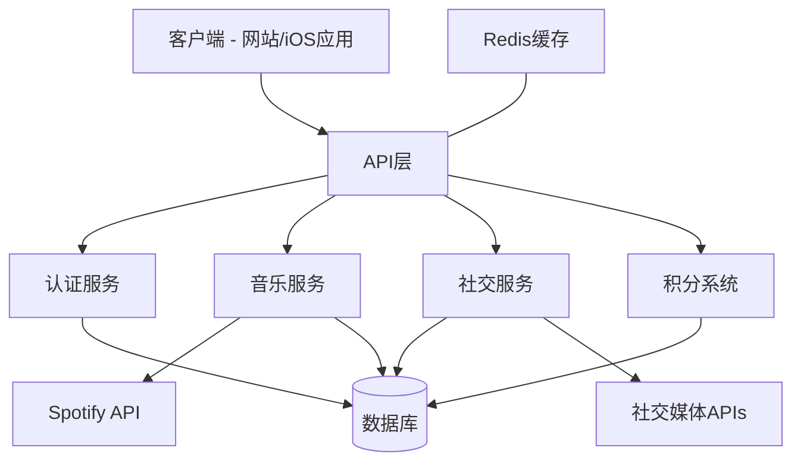

# Design Document

## Overview

Flowtithmusic是一个音乐社交平台，允许用户通过音乐表达情感并与朋友分享。该平台采用现代化的技术栈，确保在网站和未来的iOS应用程序中提供一致的用户体验。设计遵循苹果专业UI设计规范，注重美观性和用户体验。

## Architecture

### 技术栈选择

为了确保跨平台兼容性和未来扩展性，我们选择以下技术栈：

1. **前端框架**：
   - Next.js (React框架)：提供服务器端渲染(SSR)和静态站点生成(SSG)能力，有利于SEO优化
   - React Native (未来iOS应用)：可以复用大部分业务逻辑代码

2. **样式解决方案**：
   - Tailwind CSS：快速构建响应式UI
   - Framer Motion：实现流畅的动画效果
   - 自定义CSS：实现手写字体和特殊视觉效果

3. **后端技术**：
   - Node.js + Express：构建RESTful API
   - MongoDB：灵活的NoSQL数据库，适合存储用户生成内容
   - Redis：缓存热门内容和会话管理

4. **认证系统**：
   - NextAuth.js：处理Gmail第三方登录
   - JWT：管理用户会话

5. **第三方API集成**：
   - Spotify API：音乐搜索和播放
   - 社交媒体API：验证用户社交账号

6. **部署与DevOps**：
   - Vercel：前端部署
   - MongoDB Atlas：云数据库
   - GitHub Actions：CI/CD流程

### 系统架构图



## Components and Interfaces

### 核心组件

1. **用户认证组件**
   - 负责用户注册、登录和会话管理
   - 处理第三方认证(Gmail)
   - 管理用户权限

2. **音乐信件组件**
   - 处理信件创建、存储和展示
   - 集成Spotify API进行音乐搜索和播放
   - 生成分享链接

3. **社交关系组件**
   - 管理用户之间的关系
   - 处理社交媒体账号验证
   - 提供用户发现功能

4. **积分与VIP组件**
   - 管理积分的获取、消费和购买
   - 处理VIP订阅逻辑
   - 控制高级功能访问权限

### 页面组件结构

1. **首页组件**
   ```
   HomePage
   ├── Header
   ├── HeroSection
   ├── MusicLetterCarousel
   │   └── LetterCard
   ├── FeaturesSection
   └── Footer
   ```

2. **创建信件组件**
   ```
   CreateLetterPage
   ├── LetterForm
   │   ├── NicknameInput
   │   ├── MusicSearch
   │   │   └── SongResults
   │   └── MessageInput
   ├── LetterPreview
   └── ShareOptions
   ```

3. **信件详情组件**
   ```
   LetterDetailPage
   ├── LetterContent
   │   ├── SenderInfo
   │   ├── MusicPlayer
   │   └── MessageDisplay
   ├── RelatedUsers
   │   ├── ViewersList
   │   ├── SameSongUsersList
   │   └── SameArtistUsersList
   └── ActionButtons
   ```

4. **用户资料组件**
   ```
   ProfilePage
   ├── UserInfo
   ├── SocialMediaLinks
   ├── PointsDisplay
   ├── VIPStatus
   └── VisitorsList (VIP专用)
   ```

### API接口设计

1. **认证API**
   - `POST /api/auth/login` - Gmail登录
   - `GET /api/auth/user` - 获取当前用户信息
   - `POST /api/auth/logout` - 登出

2. **音乐信件API**
   - `GET /api/music/search?q={query}` - 搜索歌曲
   - `POST /api/letters` - 创建新信件
   - `GET /api/letters/{id}` - 获取信件详情
   - `GET /api/letters/trending` - 获取热门信件

3. **用户API**
   - `GET /api/users/{id}` - 获取用户资料
   - `PUT /api/users/{id}/social` - 更新社交媒体链接
   - `GET /api/users/{id}/visitors` - 获取访问者列表(VIP)
   - `GET /api/users/related/{songId}` - 获取相关用户

4. **积分API**
   - `GET /api/points/balance` - 获取积分余额
   - `POST /api/points/purchase` - 购买积分
   - `POST /api/points/consume` - 消费积分
   - `POST /api/vip/subscribe` - 订阅VIP

## Data Models

### User Model

```javascript
{
  _id: ObjectId,
  email: String,
  name: String,
  avatar: String,
  createdAt: Date,
  socialMedia: {
    tiktok: String,
    instagram: String,
    twitter: String,
    facebook: String,
    whatsapp: String
  },
  points: Number,
  vip: {
    isActive: Boolean,
    expiresAt: Date,
    plan: String
  },
  visitedBy: [{ userId: ObjectId, timestamp: Date }]
}
```

### Letter Model

```javascript
{
  _id: ObjectId,
  creatorId: ObjectId,
  nickname: String,
  song: {
    spotifyId: String,
    title: String,
    artist: String,
    albumCover: String,
    previewUrl: String
  },
  message: String,
  createdAt: Date,
  shareLink: String,
  views: Number,
  viewers: [{ userId: ObjectId, timestamp: Date }]
}
```

### PointTransaction Model

```javascript
{
  _id: ObjectId,
  userId: ObjectId,
  amount: Number,
  type: String, // "earn", "spend", "purchase"
  description: String,
  createdAt: Date,
  relatedEntityId: ObjectId // 可能关联到用户或信件
}
```

## Error Handling

### 错误处理策略

1. **前端错误处理**
   - 使用React Error Boundaries捕获组件错误
   - 实现全局错误处理器记录客户端错误
   - 为用户提供友好的错误提示和恢复选项

2. **API错误处理**
   - 使用统一的错误响应格式
   - 实现中间件处理常见错误场景
   - 记录服务器端错误以便调试

3. **错误响应格式**
   ```javascript
   {
     success: false,
     error: {
       code: "ERROR_CODE",
       message: "User friendly error message",
       details: {} // 可选的详细信息
     }
   }
   ```

4. **常见错误码**
   - `AUTH_REQUIRED` - 需要认证
   - `INSUFFICIENT_POINTS` - 积分不足
   - `RESOURCE_NOT_FOUND` - 资源未找到
   - `SPOTIFY_API_ERROR` - Spotify API错误
   - `VALIDATION_ERROR` - 输入验证错误

## Testing Strategy

### 测试层次

1. **单元测试**
   - 测试核心业务逻辑和工具函数
   - 使用Jest作为测试框架
   - 模拟外部依赖(如Spotify API)

2. **组件测试**
   - 使用React Testing Library测试UI组件
   - 验证组件渲染和交互行为
   - 测试组件在不同状态下的表现

3. **API测试**
   - 测试API端点的功能和错误处理
   - 验证数据验证和业务规则
   - 使用Supertest进行HTTP请求测试

4. **端到端测试**
   - 使用Cypress模拟用户流程
   - 测试关键用户旅程(如创建信件、分享、查看)
   - 验证跨组件和服务的集成

### 测试自动化

- 配置GitHub Actions在每次提交时运行测试
- 实现测试覆盖率报告
- 在部署前验证所有测试通过

## UI/UX设计

### 设计原则

1. **遵循苹果设计语言**
   - 使用SF Pro字体
   - 应用苹果风格的圆角和阴影
   - 采用苹果推荐的颜色系统

2. **响应式设计**
   - 移动优先设计方法
   - 断点: 移动端(<768px)、平板(768px-1024px)、桌面(>1024px)
   - 使用Flexbox和Grid布局实现响应式UI

3. **动效设计**
   - 使用Framer Motion实现流畅过渡
   - 为卡片轮播添加动态效果
   - 实现微交互提升用户体验

### 颜色系统

```css
:root {
  /* 主色调 */
  --primary-light: #8A2BE2; /* 紫色调 */
  --primary: #6A0DAD;
  --primary-dark: #4B0082;
  
  /* 辅助色 */
  --accent-light: #FF6B6B; /* 珊瑚红 */
  --accent: #FF5252;
  --accent-dark: #FF4081;
  
  /* 中性色 */
  --neutral-100: #FFFFFF;
  --neutral-200: #F5F5F7;
  --neutral-300: #E5E5EA;
  --neutral-400: #D1D1D6;
  --neutral-500: #C7C7CC;
  --neutral-600: #8E8E93;
  --neutral-700: #636366;
  --neutral-800: #3A3A3C;
  --neutral-900: #1C1C1E;
  
  /* 功能色 */
  --success: #34C759;
  --warning: #FF9500;
  --error: #FF3B30;
  --info: #007AFF;
}
```

### 字体系统

```css
:root {
  /* 系统字体 */
  --font-system: -apple-system, BlinkMacSystemFont, "SF Pro Text", "Segoe UI", Roboto, Helvetica, Arial, sans-serif;
  
  /* 手写字体 */
  --font-handwriting: "Caveat", "Sriracha", cursive;
  
  /* 字体大小 */
  --text-xs: 0.75rem;   /* 12px */
  --text-sm: 0.875rem;  /* 14px */
  --text-base: 1rem;    /* 16px */
  --text-lg: 1.125rem;  /* 18px */
  --text-xl: 1.25rem;   /* 20px */
  --text-2xl: 1.5rem;   /* 24px */
  --text-3xl: 1.875rem; /* 30px */
  --text-4xl: 2.25rem;  /* 36px */
  --text-5xl: 3rem;     /* 48px */
}
```

### 关键页面布局

1. **首页布局**
   - 全宽Hero区域，带有动态背景
   - 卡片网格布局，在移动端转为单列
   - 固定导航栏，在移动端转为汉堡菜单

2. **创建信件页面**
   - 两列布局(表单和预览)，在移动端转为单列
   - 步骤指示器显示创建进度
   - 固定底部操作栏

3. **信件详情页面**
   - 信件内容占据上半部分
   - 相关用户列表以水平滚动方式展示
   - 音乐播放器固定在底部

4. **个人资料页面**
   - 顶部用户信息卡片
   - 标签式导航切换不同内容区域
   - 社交媒体链接以图标网格展示

## SEO策略

1. **页面元数据**
   - 为每个页面设置唯一的标题和描述
   - 使用规范URL(canonical URL)避免重复内容
   - 实现Open Graph和Twitter Card标签

2. **结构化数据**
   - 使用Schema.org标记增强搜索结果
   - 为音乐内容添加MusicRecording标记
   - 为用户资料添加Person标记

3. **性能优化**
   - 实现图片懒加载
   - 优化核心Web指标(LCP, FID, CLS)
   - 使用Next.js的ISR功能提高页面加载速度

## 安全考虑

1. **认证与授权**
   - 实现JWT基于角色的访问控制
   - 防止未授权访问受保护资源
   - 安全存储用户凭证

2. **数据保护**
   - 加密敏感用户数据
   - 实现HTTPS确保传输安全
   - 遵循数据最小化原则

3. **API安全**
   - 实现速率限制防止滥用
   - 验证所有API输入
   - 防止常见的Web安全漏洞(XSS, CSRF)